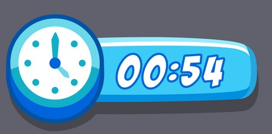

## Game Elements

### _Energy Level Bar (or Fatigue bar)_

This bar relates to the Pocket Gopher energy, it decreases whenever Brave expends energy to move objects in the game and can be recovered in three ways:
* Resting stationary in the path; (slow recovery);
* By eating food (Depending on the food property);
* By sleeping;

If the bar reaches the minimum value you're obliged to stuck in the same position until the 20% is recovered up. This means that you'd be exposed to possible attacks during that time!

The decreasing and increasing energy speed depends on the experience level.

### _Smart Points Bar_

This bar is a Smat Points collector: Whenever the bar reaches its maximum value, Brave sprints to the next level of experience (ex. Level 1 to level 2). Each time you reach a new Experience level, the bar is reset.

### _Backpack_

### _Pillow Bags_

The progress of the bar depends on the following characteristics:

* By the number of moves made to complete the level;
* From the energy expended;
* The time taken to complete the level;

Be smart and, spend minimal energy, quickly and with the minimal movements to reach high points!

### _Experience Level_

Experience Level is an indicator of your skill through the game. In fact, at the same level, a player can reach a higher experience level by increasing the Brave Bar faster.

By reaching certain levels of experience, it is possible to unlock new techniques that can be used by Brave to be able to face enemies more easily.

### _Level Time Counter_

Each level has a maximum time to complete. The only way to be able to change the time is through some techniques that can be acquired by Brave such as the Freeze Time (which can block time temporarily) or the Black Hole Deviation (which allows you to slow down the time of the opponents.

If the level is not completed within the allotted time, Brave loses Smart points and is forced to restart the level.